Anaconda 是一个用于科学计算的 Python 发行版，支持 Linux、Mac、Windows, 集成 conda 包管理工具和常用科学计算库（如 NumPy、Pandas），支持创建独立环境以解决项目间的依赖冲突。

<!-- more -->

## 安装 Anaconda

访问 [Anaconda 官网](https://www.anaconda.com/download) ，后续的所有操作均不需要注册账号，可直接点击 `Skip registration` 跳过注册。


下载对应系统的安装包

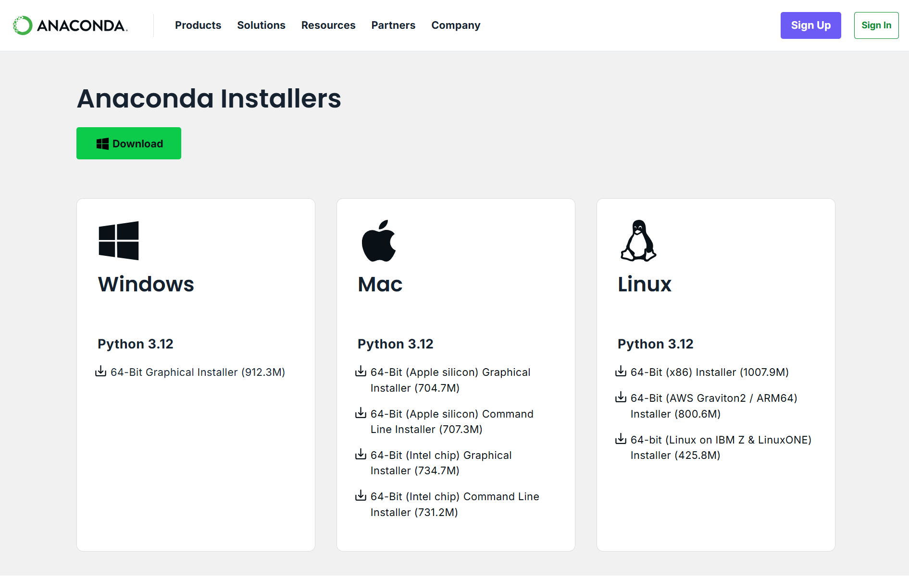

### Windows 系统安装

#### 安装

下载 `Windows 64-bit` 安装包，点击下载好的软件进入安装界面，点击 `next`。

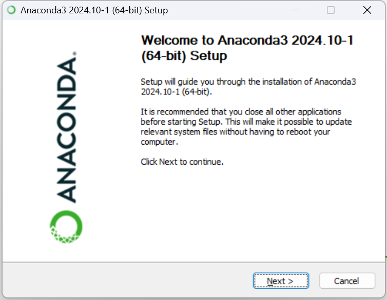

阅读并接受许可协议，点击 `I Agree`。

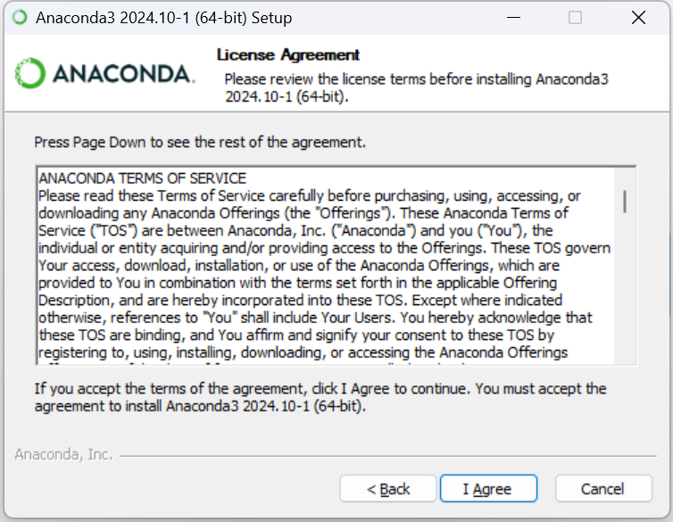

选择安装范围：

- `All Users`（需要**管理员**权限）
- `Just Me`（默认，仅为当前用户安装）

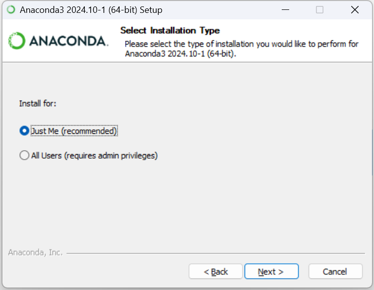

选择 Anaconda 的安装路径。

::: tip 路径选择
路径里最好不要有中文或者带特殊符号（单引号之类的）
~~用户名最好也这样~~
:::


点击 `Install` 进行安装

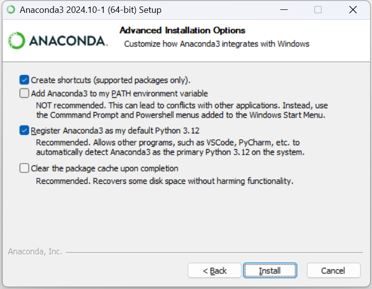

安装完成！

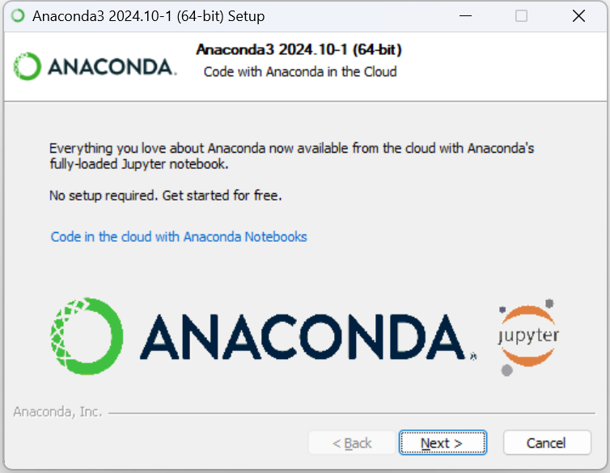

#### 配置环境变量

接下来配置环境变量，在 Windows 设置中搜索「环境变量」，选择「编辑系统环境变量」。

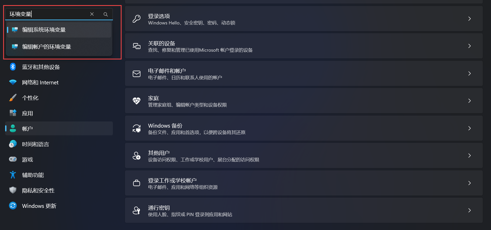

点击右下角的 `环境变量`

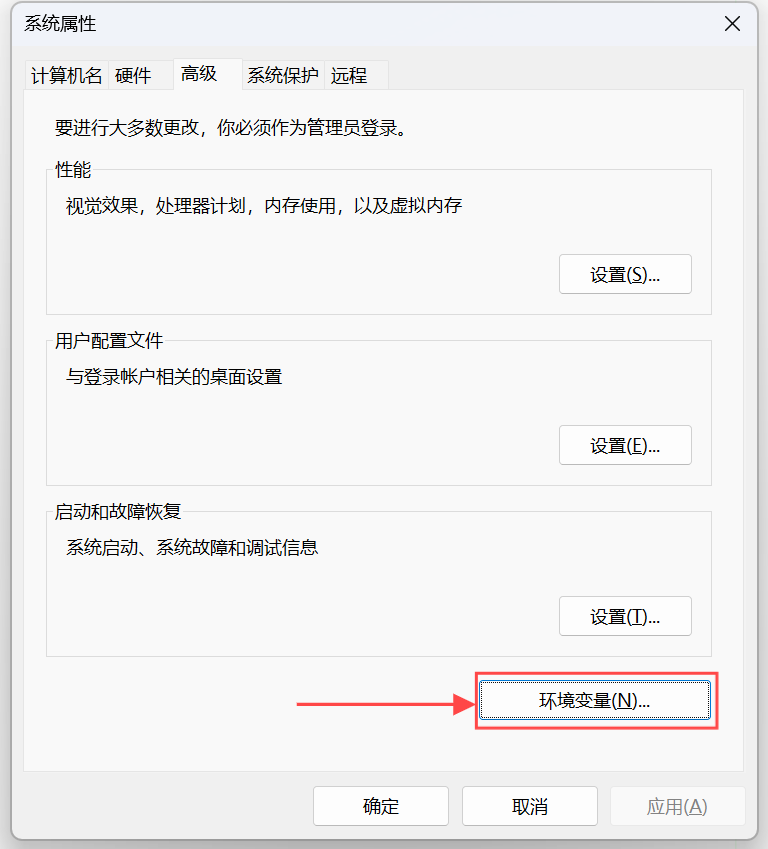

在系统变量中找到 `Path`，点击 `编辑`

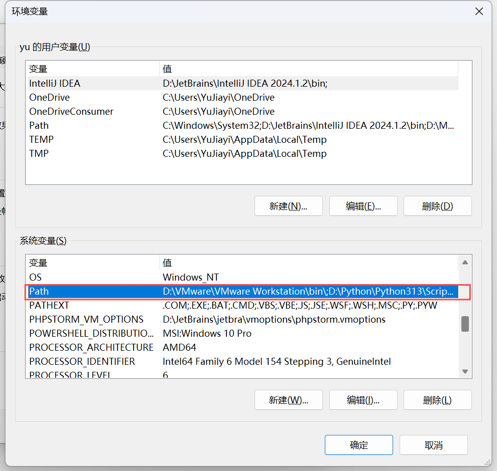

在 `Path` 中新建三个环境变量，分别为

```text
<Anaconda 安装路径>
<Anaconda 安装路径>\Scripts
<Anaconda 安装路径>\Library\bin
```

> 例如，Anaconda 安装在 ``D:\anaconda3``，那么要添加的变量就为
> D:\anaconda3
> D:\anaconda3\Scripts
> D:\anaconda3\Library\bin

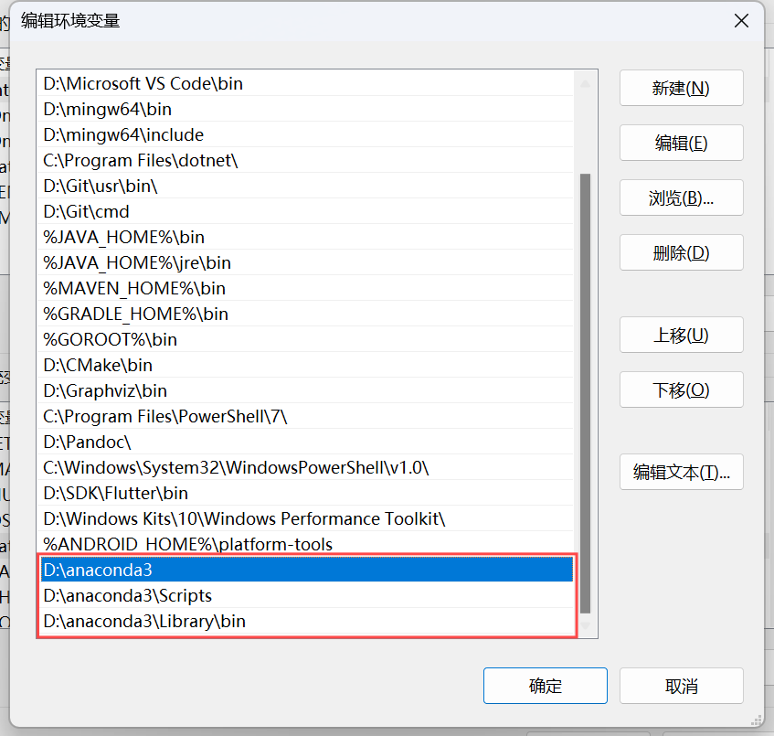

然后依次点击 `确定` 完成设置

::: tip Anaconda 与 Python
上述操作会将 Anaconda 的 Python 添加到环境变量中。如果系统中已安装 Python，系统会根据环境变量 `Path` 中的顺序查找 Python。**谁在前面，就用谁**。可以用下列命令来查看使用的是哪个 `python`

```cmd
which python
```

:::

### macOS 系统安装

根据你的系统芯片架构选择正确的版本进行安装

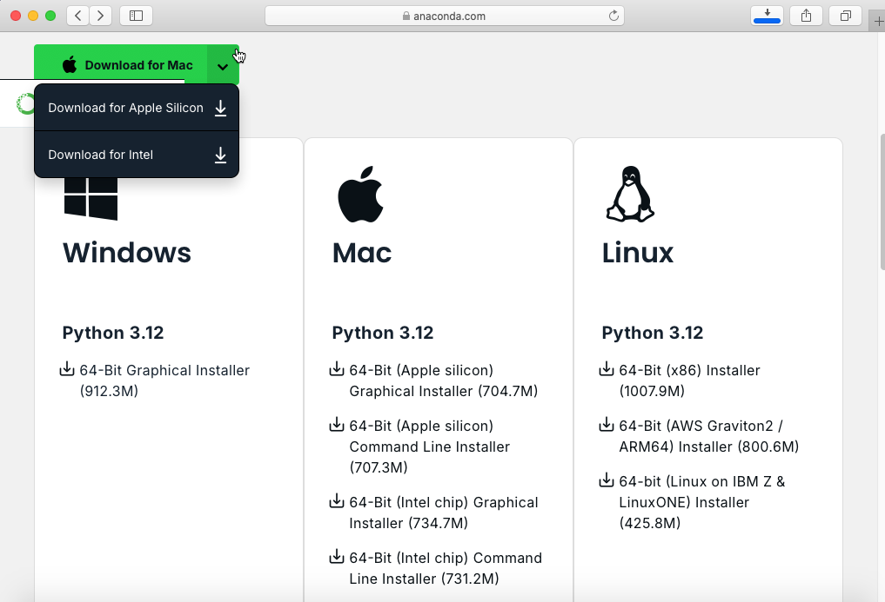

#### 图形界面安装（Graphical Installer）

运行下载的 `.pkg` 文件，按照提示 `continue`

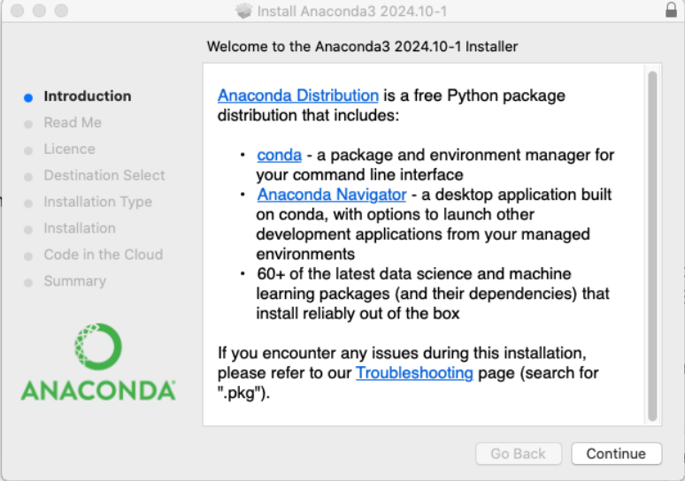

输入密码后，等待安装完成。

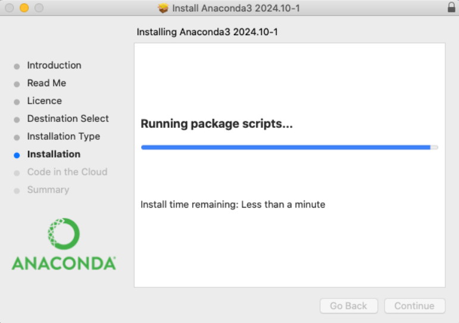

安装成功！


#### 命令行安装（Command Line Installer）

~~有图形界面为什么要用命令行呢~~

下载安装脚本后，在终端中执行以下命令

```bash
bash Anaconda3-2024.10-1-MacOSX-x86_64.sh
```

安装时按 `Enter` 阅读协议，输入 `yes` 确认

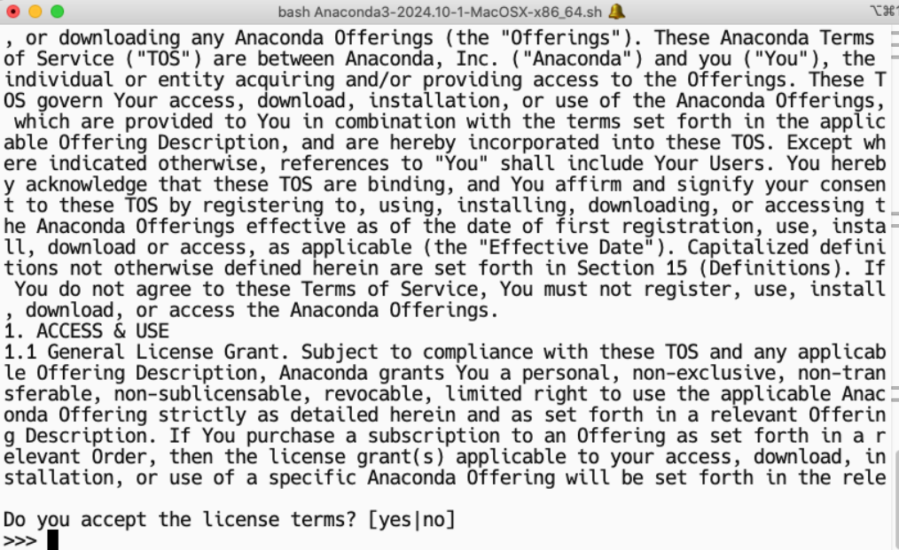

默认安装路径为 ``/home/<user>/anaconda3``
安装程序提示「您是否希望安装程序通过运行 conda init 来初始化 Anaconda3？」
推荐选择 `yes`，若选择 `no` 后续也可自行初始化。

```bash
source /home/<user>/anaconda3/bin/activateconda init zsh
```

### Linux 系统安装步骤

下载 Anaconda 安装脚本：

```bash
# 具体版本可自行选择
wget https://repo.anaconda.com/archive/Anaconda3-2024.10-1-Linux-x86_64.sh
```

运行安装脚本：

```bash
bash Anaconda3-2024.10-1-Linux-x86_64.sh
```

安装时按 `Enter` 阅读协议，输入 `yes` 确认安装。


按 `Enter` 安装到默认路径 ``/home/<user>/anaconda3``，也可以自定义路径


安装好后可以选择是否立即初始化，若选择 no，可自行初始化

```bash
# 根据实际情况修改初始化命令中的 conda 路径
# YOUR_SHELL_NAME 为你所使用的 shell，可通过 echo $SHELL 查看
eval "$(/home/<user>/anaconda3/bin/conda shell.YOUR_SHELL_NAME hook)"

source ~/.bashrc  # 或 source ~/.zshrc
```

在终端中输入以下命令验证是否安装成功：

```bash
conda --version
```

如果显示 conda 的版本号，则表示安装成功

### Miniconda

**Miniconda** 是 Anaconda 的精简版，仅包含 Python、conda、必要的依赖库，而不预装其他科学计算包（如 NumPy、Pandas），因此占用的空间会比 Anaconda 少。

官网也提供了 Miniconda 的安装包，安装和使用方法均与 Anaconda 类似

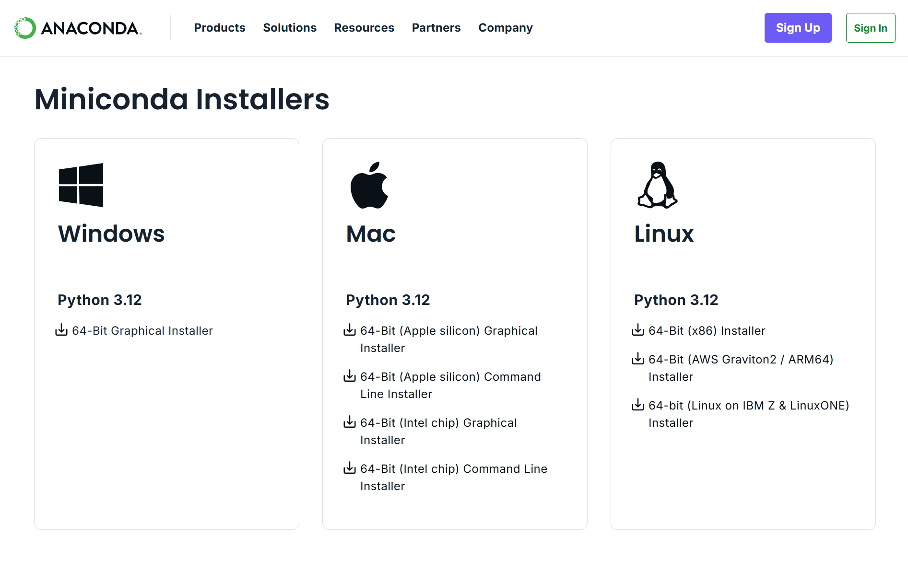

## 使用 Anaconda

### 图形界面

打开 **Anaconda Navigator**

::: tabs#os

@tab Windows

开始菜单 -> 搜索 Anaconda Navigator
或使用快捷方式双击桌面图标

@tab macOS

应用程序文件夹 -> 双击 Anaconda-Navigator.app

@tab Linux

```bash
# 终端输入
anaconda-navigator
```

:::

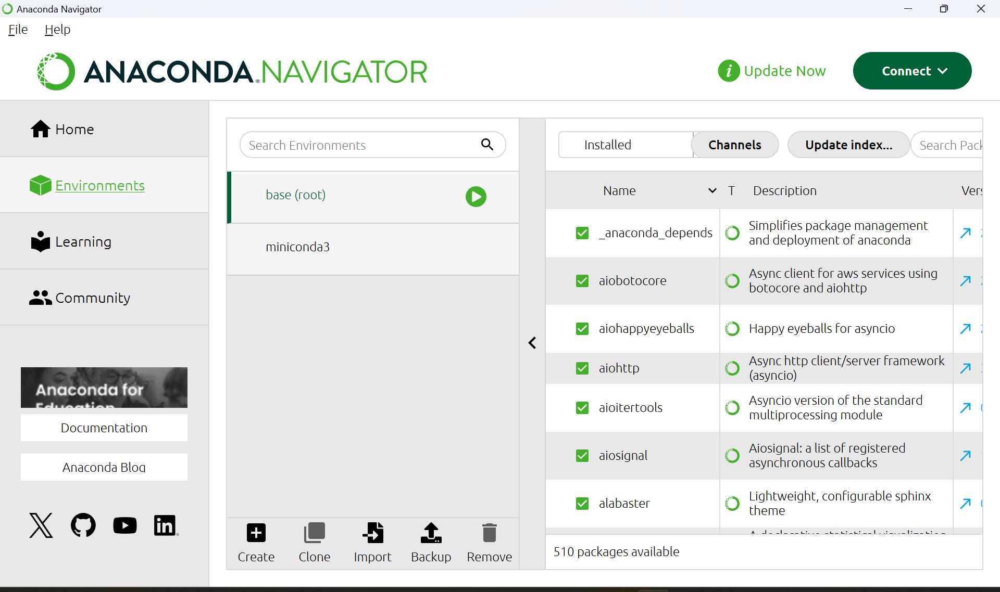

- **Home**：常用应用入口
- **Environments**：环境管理
- **Learning**：官方教程
- **Community**：社区论坛

#### 图形界面环境管理

##### 图形界面创建新环境

- 打开 `Environments` 选项卡，点击 `Create`。
- 输入环境名称（建议英文），选择 Python 版本，点击 `Create`。


##### 克隆/删除环境

- 选中环境 -> 点击 `Clone` 复制环境
- 选中环境 -> 点击 `Remove` 删除环境

::: warning 危险操作
不要删除 base 环境！这是 Conda 的默认运行环境
:::

#### 图形界面包管理

- 选择目标环境
- 筛选要安装/更新的包（可用 Installed / Not installed 等进行筛选），点击 `Apply` 批量安装/更新

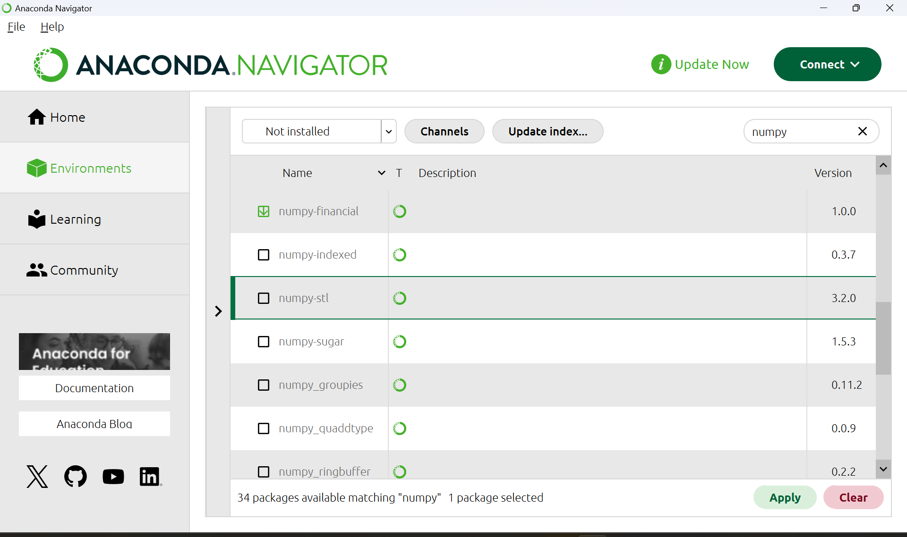

### conda 命令

除了图形界面操作，还可以在命令行使用 conda 来管理不同环境。
conda 是 Anaconda 发行版中的包管理器，用于安装、更新、卸载软件包，以及创建和管理不同的 Python 环境。

#### 命令行环境管理

##### 命令行创建新环境

```bash
# --name 或 -n 后接环境的名称（建议使用英文）
conda create --name env_name package_names
```

例如：创建一个名为 `myenv` 的新环境

```bash
conda create --name myenv
conda create -n myenv python=3.11   # 创建指定版本的环境
conda create -n myenv numpy pandas  # 创建环境同时安装包
```

##### 环境激活与切换

```bash
conda activate myenv          # 进入环境
conda deactivate              # 退出环境
```

##### 查看环境列表

```bash
conda env list    # * 表示当前环境
# 或者：
# conda info -e
# conda info --envs
```

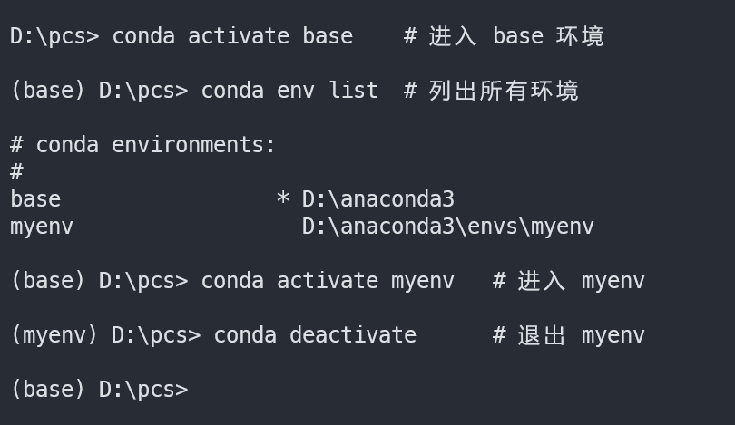

##### 复制环境

```bash
conda create --name new_env_name --clone copied_env_name
```

##### 删除环境

删除名为 `myenv` 的环境。

```bash
conda env remove --name myenv --all
```

##### 环境导出与创建

```bash
# 导出环境
conda env export > environment.yml

# 从文件创建环境
conda env create -f environment.yml
```

生成的 `environment.yml` 里包含所有已安装的包和 Python 版本，例如

```yml
name: myenv
channels:
   - defaults
dependencies:
   - python=3.9
   - numpy
   - pip:
      - requests
prefix: /home/<user>/anaconda3/envs/myenv
```

#### 命令行包管理

##### 安装包

- 安装：

```bash
conda install package_name
# 例如 conda install numpy
```

- 指定版本安装：

```bash
conda install package_name=1.2.3
# 例如 conda install pandas=1.5.3
```

##### 删除包

- 卸载指定环境中的包

```bash
conda remove --name env_name package_name
```

- 卸载当前环境中的包

```bash
conda remove package_name
```

##### 更新包

```bash
conda update package_name
```

##### 查看已安装的包

```bash
conda list
```

#### channel 管理

默认情况下，`conda install` 命令会从 **defaults** 源下载软件包，但有时需要使用 **conda-forge** 等丰富的社区仓库。

##### 查看当前可用的 channel

```bash
conda config --show channels
```

##### 添加 conda-forge 作为额外的包源

```bash
conda config --add channels conda-forge
```

##### 删除某个 channel

```bash
conda config --remove channels conda-forge
```

##### 使用特定 channel 安装包

```bash
conda install -c conda-forge package_name
```

#### 其他常用命令

##### 查看帮助

```bash
conda --help
# 或 conda -h
```

##### 查看 conda 版本

```bash
conda --version
# 或者 conda -V
```

##### 搜索包

```bash
conda search package_name
```

以上代码在 conda 仓库中搜索指定的软件包。

##### 清理不再需要的包

```bash
conda clean --all
```

以上代码清理 conda 缓存，删除不再需要的软件包。

##### 查看 Conda 信息

```bash
conda info
```

## 常见问题解决方案

### 'conda' 不是内部或外部命令,也不是可运行的程序 或批处理文件

**解决方法**：

- Windows：
  - 使用 `Anaconda Prompt` 和 `Anaconda PowerShell Prompt`  代替 `Command` 和 `PowerShell`
  - [编辑环境变量](#配置环境变量)
- macOS/Linux：

  ```bash
  # 请将 <your_path_to_anaconda> 替换为实际 anaconda 路径
  echo 'export PATH="<your_path_to_anaconda>/bin:$PATH"' >> ~/.zshrc

  # 若使用 bash，则为 ~/.bashrc
  source ~/.zshrc
  ```

### CondaError: Run 'conda init' before 'conda activate'

**解决方法**：
::: tabs#shell

@tab command

```cmd
conda init cmd.exe
```

@tab PowerShell

```powershell
conda init powershell
```

@tab zsh

```zsh
conda init zsh
```

@tab bash

```bash
conda init bash
```

:::

也可以一次性所有支持的终端环境进行初始化

```bash
conda init --all
```

如果不想每次打开终端时都自动激活 base 环境，可以运行：

```bash
conda config --set auto_activate_base false
```
